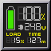

## APC ups status dockapp

Shows status of APC ups as reported by [apcupsd](http://www.apcupsd.org/)

## Requires

* [Windowmaker](https://www.windowmaker.org/) or some windowmanager that can show GNUStep style dockapps. There is an [xfce4 panel plugin](https://goodies.xfce.org/projects/panel-plugins/xfce4-wmdock-plugin) that can hold the dockapps.
* [libdockapp](https://www.dockapps.net/libdockapp)
* [apcupsd](http://www.apcupsd.org/) running with its NIS interface active and monitoring the UPS you are intereseted in.
* GNU autotools (automake, autoconf etc.)

## Build

    autoreconf -i
    ./configure
    make
    make install

## Running

When run without any parameters it would attempt to contact the apcups daemon runing on localhost.

    wmdockapp [-H <apcupsd_hostname>] [-P <port>] [-h] [-t]

- `apcupsd_hostname` : Host where apcupsd is running. (Default: 127.0.0.1)
- `port` : apcupsd NIS port (if different from 3551).
- `-h` : shows online help.
- `-t` : Test connection. Would not start the dockapp.
